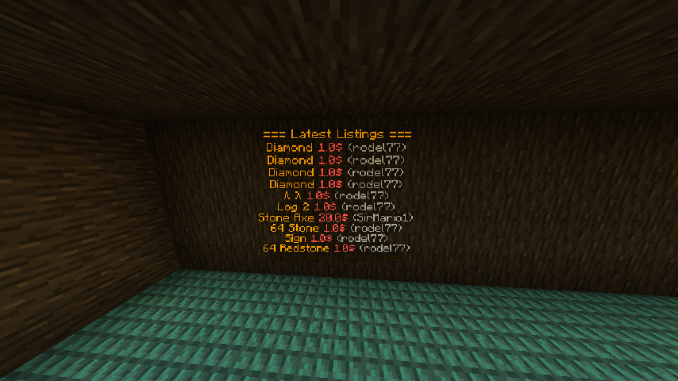

================
Placeholder API
================

In marketplace you have the ability to link with `Placeholder API <https://www.spigotmc.org/resources/6245/>`_, these are the current one you can use:

``%marketplace_last_[x]%`` will allow you to show the latest listings published on your server, you can use from 1 to 10 (1th being the latest and 10th the oldest)

With this placeholder you can do something like this

``%marketplace_limit%`` show the published listings limit to that player

``%marketplace_published%`` show the amount of published listings

``%marketplace_limit_remaining%`` show the remaining slots (`limit-published`)