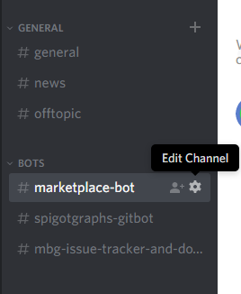
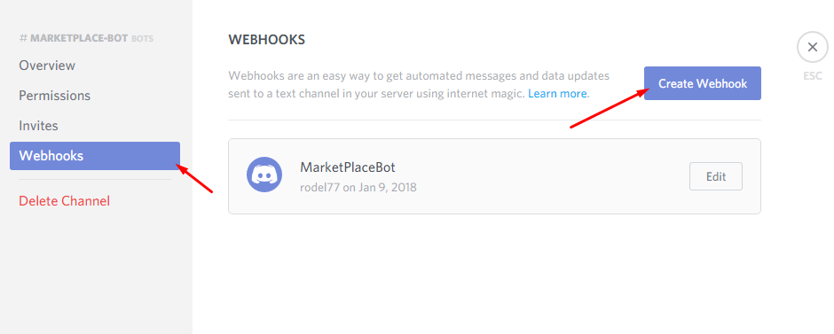
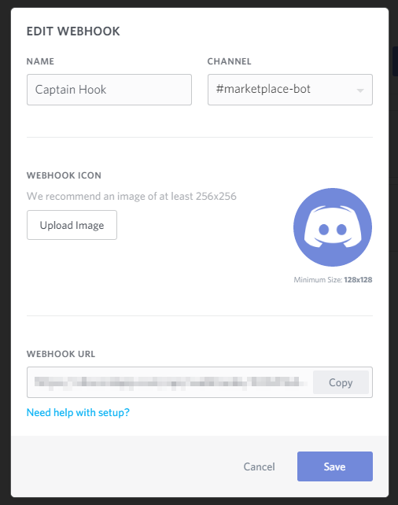
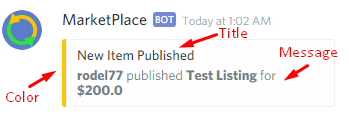

================
Discord WebHooks
================

In MarketPlace you can add notifications into your Discord Server, this will send custom messages about new listings and purchases (You can enable what you want)

Getting Webhook URL
===================

+ Click ``Edit channel`` in the channel that you want to put the bot

+ Now click on ``Webhooks`` and then ``Create Webhook``

+ Then it will open this:

+ Now copy the ``WEBHOOK URL`` this is secret, with this URL any software can send messages to that channel

.. note:: Is not needed to edit name or avatar image, it will be overrited by the plugin (In the config, see above)

Configuration
=============

Now lets configure the webhook in the plugin!

+ Make sure that you are using at least MarketPlace **1.3.0**
+ Open your ``config.yml`` and search the ``discordWebhook`` key, usually at the bottom
+ By default it is disabled, ``enabled: false`` turn it on, ``enabled: true``
+ Now paste the URL you copy before and paste it on the ``url:`` key
+ To make the first test or report errors with webhooks you can enable ``debug:``, this will print a lot of information about the hook (If you report errors make sure to remove the webhook url to avoid)
+ Then you can change the ``botName:`` and the ``botAvatar:`` the avatar by default its this:

+ You can modify the messages to, the title, message/description and color

+ The color format its in hex, so you may wan't to use a hex color selector, Chrome has one built-in, but its a bit tricky to use it, then you can use this: https://www.webpagefx.com/web-design/color-picker/
+ Awesome, you have setup the webhook! Now just do ``/mp reload`` publish an item or buy one to test that your webhook work! (If you have any problem enabled debug and send me all debug logs)

What is a WebHook
=================

This is a bit more techical, for those ones that are curious!

A page gives you an URL, and then you can send stuff to that URL like a RESTAPI, its generally used to send notifications, create builds from git commits... etc